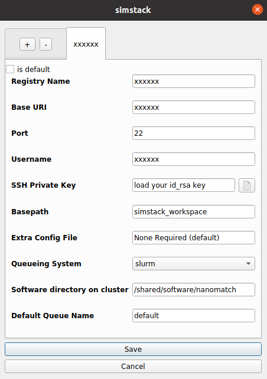
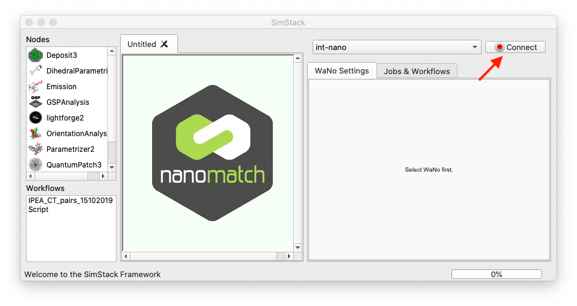

# SimStack setup

## Download the SimStack client

1. The SimStack client (Linux and Windows) can be downloaded from the [SimStack webpage](https://www.simstack.de/?page_id=216)


## Install and Launch SimStack client
The SimStack client installs itself and all dependencies during the first launch. After extracting the downloaded archive just start this process:

1. Linux

```bash
cd  simstack_linux
./run_simstack.sh
```

2. Windows

Double click on `run-simstack.bat`


## Connect to compute ressources (SimStack Server)

### Passwordless SSH

For communicating with a compute backend, the SimStack client requires passwordless SSH access. If you do not have `ssh` access to the HPC resource already preconfigured, or are provided with an SSH key in the context of a tutorial, you need to generate a SSH keypair and transfer it to the Compute backend. This can be achieved with two simple commands:

1. Linux

```
ssh-keygen -t ed25519
ssh-copy-id tutorialXX@int.bionano.int.kit.edu
```

2. Windows (https://phoenixnap.com/kb/generate-ssh-key-windows-10)

### Simstack Server Configuration

Setup the server by opening the configuration menu: `Configuration` -> `Servers`


If passwordless `ssh` is setup correctly, you should now be able to connect by clicking the `Connect` button at the top right of SimStack:

